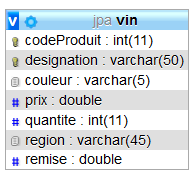

# 3 - ENTITY VIN (corrigé): CLE PRIMAIRE COMPOSITE avec @IdClass (**pinard03**)

## Création du projet **pinard03**

Pour ce projet, j'ai utilisé le plug-in du projet **Lombok** dont voici le lien ci-dessous :

[Projet Lombock](https://projectlombok.org)

Pour l'installer dans Eclipse, il suffit de sélectionner **Help** puis **Install New software...** puis **Add** et saisir les informations suivantes :

Lombok [https://projectlombok.org/p2](https://projectlombok.org/p2) puis valider. Il faut cocher la case *Lombok* et poursuivre l'installation.

Relancez Eclipse et ça devrait vous simplifier la vie !

Maintenant, si vous souhaitez l'ajouter à vos dépendances Gradle pour votre projet Spring Boot, allez sur *mvnrepository.com*
et récupérez le lien qui doit ressembler à ceci :

```java
// https://mvnrepository.com/artifact/org.projectlombok/lombok
compileOnly group: 'org.projectlombok', name: 'lombok', version: '1.18.24'

```

Ensuite, ajoutez les annotations suivantes dans la classe **Vin.java** :

```java
@Entity
@IdClass(VinPK.class)
@Getter
@Setter
@NoArgsConstructor
@EqualsAndHashCode
@ToString
public class Vin implements Serializable {
```

J'ai aussi utilisé un type **enum** pour le choix des couleurs du vin :

```java
 public enum choix {ROUGE,BLANC,ROSE};
    
    @Enumerated(value = EnumType.STRING)
    @Column(length = 5)    
    private choix couleur;
```

- Copier le contenu du projet **pinard01**

Objectif : Créer une entité *Vin* avec une clef composite, c'est-à-dire une clef composée du **codeProduit** et de la **designation**.

- Utiliser l'annotation **@IdClass** sur l'entité **Vin**
- Cette clé primaire sera composée du **codeProduit** et de la **désignation**

- Modifier la classe Vin :
  - Il faut rajouter l’annotation **@IdClass(VinPK.class)** sur la classe Vin :

```java
@Entity
@IdClass(VinPK.class)
public class Vin implements Serializable {
}
```

>Attention : Concernant les annotations, il faut choisir de les mettre TOUTES devant chaque propriété ou attribut de classe ou
TOUTES devant les méthodes getXXX() seulement ! Ne jamais faire un mix des annotations sinon, vous aurez des erreurs de Mapping.

Il faut l’annotation **@Id** devant le champ **codeProduit** ou la méthode **getCodeProduit()** de la classe *Vin* :

```java
   @Id
    public Integer getCodeProduit() {
        return this.codeProduit;
    }
```

ainsi que devant le champ **designation** ou la méthode **getDesignation()** :

```java
    @Id
    public String getDesignation() {
        return designation;
    }
```

- Créer la classe **VinPK** qui va contenir les 2 attributs qui composent la clef **composite**

>Attention : la classe VinPK n'est pas une Entity !

Dans le package `fr.pinard.model`, créer ensuite la classe **VinPK** qui comportera les attributs suivants :

```java
public class VinPK implements Serializable {
    private Integer codeProduit;
    private String designation;
```

- ajouter les getters et setters pour ces attributs ainsi que les méthodes equals() et hashCode().
- modifier la signature du Repository (car nouvelle clé primaire composée), les clef est **VinPK** et plus **Integer** !

>Remarque : Si vous le faites seul(e), il faut penser à faire passer une clef de type **VinPk** et non plus seulement le codeProduit pour détruire ou mettre à jour une quantité dans le contrôleur. Voici un bout de code pour vous mettre sur la voie avec l’instanciation d’un Vin v1 dans le contrôleur :

```java
Vin v4=new Vin();
v4.setCodeProduit(111111);
v4.setDesignation("Clos du Baron 1998");
v4.setRegion("Bordeaux (Saint-Julien)");
v4.setCouleur(choix.BLANC);
v4.setPrix(45.20);
v4.setRemise(0);
v4.setQuantite(50);
```

```java
updateQuantite(new VinPK(v4.getCodeProduit(),v4.getDesignation()),40);

/**
 * Met à jour la quantité d'un objet de type Vin
*/
public void updateQuantite(VinPK vinPk, int quantite)
{
	(vinRepository.getOne(vinPk)).setQuantite(quantite);
}
```

- Lancez l'application SpringBoot et testez sur le `localhost:8080`

Pour avoir un code respectant la notion de composant, vous pourriez réécrire ce contrôleur en créant une classe **VinService** pour y intégrer
toutes les méthodes métiers et ainsi ne pas avoir autant de code dans la méthode `String home()`. Vous pourriez aussi remplir la table Vin avec un fichier `data.sql` dans le répertoire `resources`, à vous de faire les modifications (même si le code fonctionne) : 

```java
@GetMapping("/accueil")
	@ResponseBody
	public String home(){
		
		Vin v1=new Vin();
		v1.setCodeProduit(777777);
		v1.setDesignation("Les Hauts du Tertre 1999");
		v1.setRegion("Bordeaux (Margaux)");
		v1.setCouleur(choix.ROUGE);
		v1.setPrix(11.50);
		v1.setRemise(0);
		v1.setQuantite(2);

		Vin v2=new Vin();
		v2.setCodeProduit(888888);
		v2.setDesignation("Château Marquis de Terme 1998");
		v2.setRegion("Bordeaux (Margaux)");
		v2.setCouleur(choix.BLANC);
		v2.setPrix(19.00);
		v2.setRemise(0);
		v2.setQuantite(3);

		Vin v3=new Vin();
		v3.setCodeProduit(999999);
		v3.setDesignation("Clos du Marquis 1999");
		v3.setRegion("Bordeaux (Saint-Julien)");
		v3.setCouleur(choix.ROUGE);
		v3.setPrix(22.90);
		v3.setRemise(0);
		v3.setQuantite(15);

		Vin v4=new Vin();
		v4.setCodeProduit(111111);
		v4.setDesignation("Clos du Baron 1998");
		v4.setRegion("Bordeaux (Saint-Julien)");
		v4.setCouleur(choix.BLANC);
		v4.setPrix(45.20);
		v4.setRemise(0);
		v4.setQuantite(50);


		System.out.println("ajout du produit v1 : "+v1);
		ajoutVin(v1);

		System.out.println("ajout du produit v2 : "+v2);
		ajoutVin(v2);

		System.out.println("ajout du produit v3 : "+v3);
		v3=ajoutVin(v3);
		v3.setQuantite(10);
		updateVin(v3);

		System.out.println("ajout du produit v4 : "+v4);
		v4=ajoutVin(v4);

		updateQuantite(new VinPK(v4.getCodeProduit(),v4.getDesignation()),40);

		StringBuilder sb = new StringBuilder();
		sb.append("<h1>Regardez dans votre console et dans votre base de données MySQL <strong>JPA</strong></h1>");
		sb.append("<a href='http://localhost:8080/vins'>Voir la liste des vins enregistrés</a>");
		return  sb.toString();
	}

	

	public Optional<Vin> findById(VinPK vinPk){
		return vinRepository.findById(vinPk);
	}
	/**
	 * Retourne tous les produits dans une liste
	 */
	@GetMapping("/vins")
	public Collection<Vin> findAll(){

		return vinRepository.findAll();
	}
	/**
	 * Ajoute un vin
	 */
	public Vin ajoutVin(Vin vin){
		return vinRepository.saveAndFlush(vin);
	}
	/**
	 * Met un jour un enregistrement pour un objet Vin
	 */
	public Vin updateVin(Vin vin){
		return vinRepository.saveAndFlush(vin);
	}


	/**
	 * Met à jour la quantité d'un objet de type Vin
	 */
	public void updateQuantite(VinPK vinPk, int quantite){
		(vinRepository.getOne(vinPk)).setQuantite(quantite);
	}
```

- Voici ce que vous devez obtenir comme structure pour la table Vin :



```sql
CREATE TABLE IF NOT EXISTS `vin` (
  `code_produit` int(11) NOT NULL,
  `designation` varchar(50) NOT NULL,
  `couleur` varchar(5) DEFAULT NULL,
  `prix` double NOT NULL,
  `quantite` int(11) NOT NULL,
  `region` varchar(45) DEFAULT NULL,
  `remise` double NOT NULL,
  PRIMARY KEY (`code_produit`,`designation`)
) ENGINE=InnoDB DEFAULT CHARSET=utf8;
```

- Dans votre navigateur préféré saisissez l'url ou cliquez sur ce lien [http://localhost:8080/accueil](http://localhost:8080/accueil)

[Retour vers les exercices](https://pbouget.github.io/cours/framework-back/1-jpa-orm/mapping-orm.html)

[Retour vers le cours complet](https://pbouget.github.io/cours/)